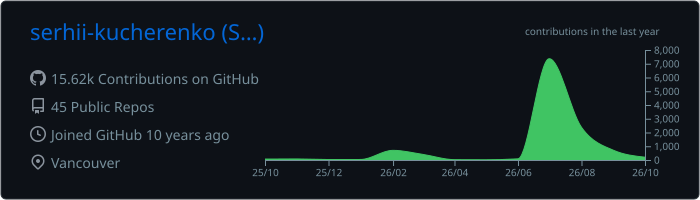
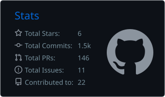
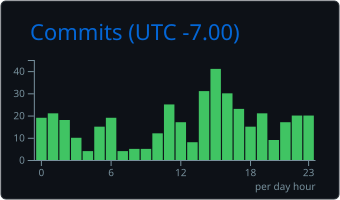

<h2> Hey there! I'm Serhii Kucherenko </h2>


<p><em>Founding full-stack engineer. Lately: persistent agent memory, LAN input sharing, annotation SDKs, Figma token PRs, AI build loops, product-idea mining, method benchmarks, research harnesses, and tiny CLIs.</em></p>

[](https://git.io/typing-svg)

[](https://www.linkedin.com/in/serhii-kucherenko/)


---

### 🎯 Goals

**💻 Code**
- [ ] 🧩 500 LeetCode problems solved
- [x] 📈 10,000+ total contributions
- [ ] 📈 50,000+ total contributions by end of 2026

**📚 Reading**
- [ ] Read all Dune books (Paul Atreides saga)
  - [x] Dune
  - [ ] Dune Messiah
  - [ ] Children of Dune
- [ ] Read all Harry Potter books
  - [x] Harry Potter and the Philosopher's Stone
  - [ ] Harry Potter and the Chamber of Secrets
  - [ ] Harry Potter and the Prisoner of Azkaban
  - [ ] Harry Potter and the Goblet of Fire
  - [ ] Harry Potter and the Order of the Phoenix
  - [ ] Harry Potter and the Half-Blood Prince
  - [ ] Harry Potter and the Deathly Hallows

**✈️ Travel**
- [ ] New Zealand
- [ ] Australia
- [ ] England
- [x] Japan
- [x] France
- [x] New York


<!-- LIVE_STATS:START -->
**Live contribution total:** **15,136** (last refreshed 2026-09-10 UTC)
<!-- LIVE_STATS:END -->

<!-- CONTRIBUTION_CHART:START -->
<p align="center">
  
</p>
<!-- CONTRIBUTION_CHART:END -->

---

### 📊 Stats

<p align="center">
  
  
</p>
<p align="center">
  
</p>
<p align="center">
  
</p>

---

### 🚀 Recent Projects

*Auto-updated weekly.*

<!-- PROJECTS_START -->
| Project | What it does | Language |
|---------|-------------|----------|
| [agent-memory-system](https://github.com/serhii-kucherenko/agent-memory-system) | Shows agents how to keep memory across tool sessions | Python |
| [hop](https://github.com/serhii-kucherenko/hop) | Shares one keyboard and mouse across local machines | Rust |
| [loupe](https://github.com/serhii-kucherenko/loupe) | Captures app feedback with screenshots, comments, and API context | Swift |
| [expo-figma-tokens](https://github.com/serhii-kucherenko/expo-figma-tokens) | Turns Figma design tokens into Expo app pull requests | JavaScript |
| [autopilot](https://github.com/serhii-kucherenko/autopilot) | Runs AI build loops from prompts to staging reviews | TypeScript |
<!-- PROJECTS_END -->

---

###  About Me

Ten years in, the throughline isn't a stack or a domain — it's a **way of working**.

I've been a founding engineer more than once. That means owning the whole thing: architecture, hiring bar, what ships and what doesn't. The titles change; the responsibility doesn't.

I like the seam between **product and systems**:
- Product work keeps me honest about whether anything I build matters to a real person
- Systems work is where I get to think about **leverage** — the architecture that makes the next ten features cheaper, faster, or possible at all

I oscillate between them on purpose. Too much of either one rots in predictable ways.

A few things I've shipped that had numbers attached: 85% page load reduction. $78K/yr in infra savings. Healthcare AI scheduling system from zero to multi-org. Financial MVP in 2 months → secure processing for 50K users. Research harness that let a 4-person team benchmark 1000+ AI workflows and catch prompt-poisoning before it shipped.

#### What I'm actually like to work with:

```bash
$ whoami
founding full-stack engineer · 10+ years · Vancouver

$ cat approach.txt
communication:  direct
philosophy:     opinionated about craft
tolerance:      allergic to ceremony that doesn't earn its keep
shipping:       ship a sharp v1 and learn > polish a v3 in the dark

$ cat the-triad.txt
The strongest engineers hold three things in their head at once:
  → the user
  → the codebase
  → the team
Skill: notice when they're pulling in different directions.

$ █
```

---

### 🛠️ Stack

[](https://skillicons.dev)

**Languages:** TypeScript, Python, Swift, Rust, JavaScript, and shell. Recent repos are persistent memory agents, LAN utilities, annotation SDKs, Figma token PRs, AI build loops, product-idea mining, method benchmarks, research harnesses, and tiny CLIs.

**Frontend:** React, Tailwind, Expo, and React Native for token demos and browser dashboards. SwiftUI for annotation tools.

**Backend:** Node.js tooling and Python scripts for build loops, research harnesses, product-idea mining, and CLIs. Rust for LAN tooling. Swift packages for macOS and iPadOS annotation. Typer, Pydantic, httpx, and Cheerio when a script is enough.

**Databases:** Light lately. Qdrant for agent-memory demos; PostgreSQL when the app needs it.

**Infra:** Vercel · npm/pnpm · GitHub automation. Docker when local services need it. Playwright, pytest, and node --test for checks.

**AI/ML:**
- Gemini · LangGraph · Qdrant
- RAG · embeddings · context packing · persistent agent memory
- AI agents · build loops · method benchmarks · review checks
- Figma agent memory · prompt harnesses

**Domain:** Persistent agent memory · LAN input sharing · app annotation SDKs · Figma token PRs · AI build loops · product-idea mining · method benchmarks · research harnesses · small CLIs.

---

### 📍 Based in Vancouver

- 💼 [LinkedIn](https://www.linkedin.com/in/serhii-kucherenko/)
- 📄 [CV](https://docs.google.com/document/d/1RiYm7zF3BVrR6wfZl9qvx1smSyrT7TJeMo_Oe3o-OXk/edit?usp=sharing)
- 🐙 [GitHub](https://github.com/serhii-kucherenko)

Whether you're building a product, scaling a team, or rethinking how your engineering org works — I'm interested in that conversation.
